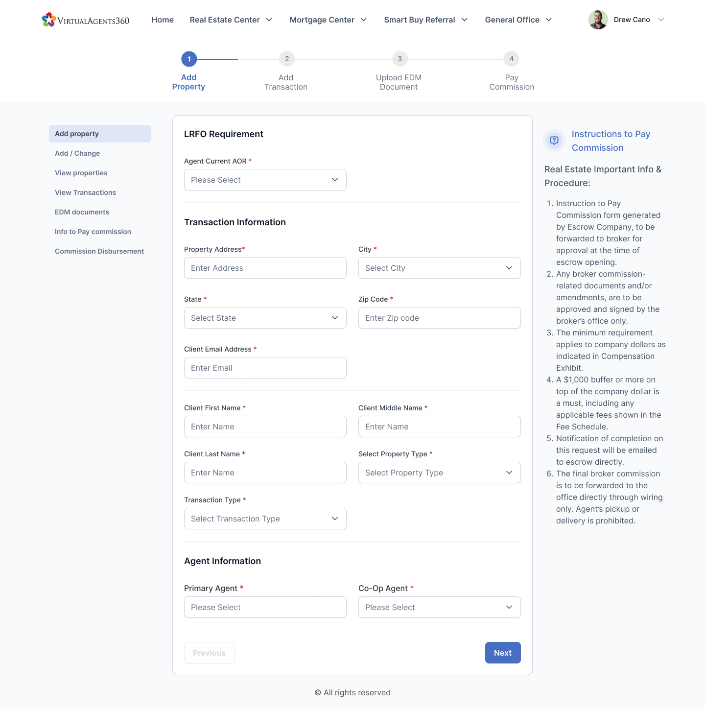

# VirtualAgents360

## Recreating a WordPress web app with NextJs and adding new features like: 
- [ ] Send templated emails on pre-defined events
- [ ] Admin dashboard to approve and reject agents' transactions
- [ ] Auth for admins to have actions and shortcuts in the UI 
- [ ] Improve form UI to track total progress per transaction and status updates
  - Improve UI in general
- [ ] CMS for marketing team to easily make revisions
- [ ] Document (pdfs) management UI and functionality
- [ ] Serverless architecture with SaaS database and backups to ensure data integrity
- [ ] AI Chatbot to assist agents
- [x] It's not wordpress

Stack: Typescript, React/Nextjs, Nodejs, Sanity (cms), Vercel

NOT PRODUCTION READY but here ya go https://virtualagents360.ethanwin.com/

## Instructions:

Docker Build
`docker build -t va360 .`

Docker run
`docker run --env-file .env.local va360`

or just simple `npm run dev`